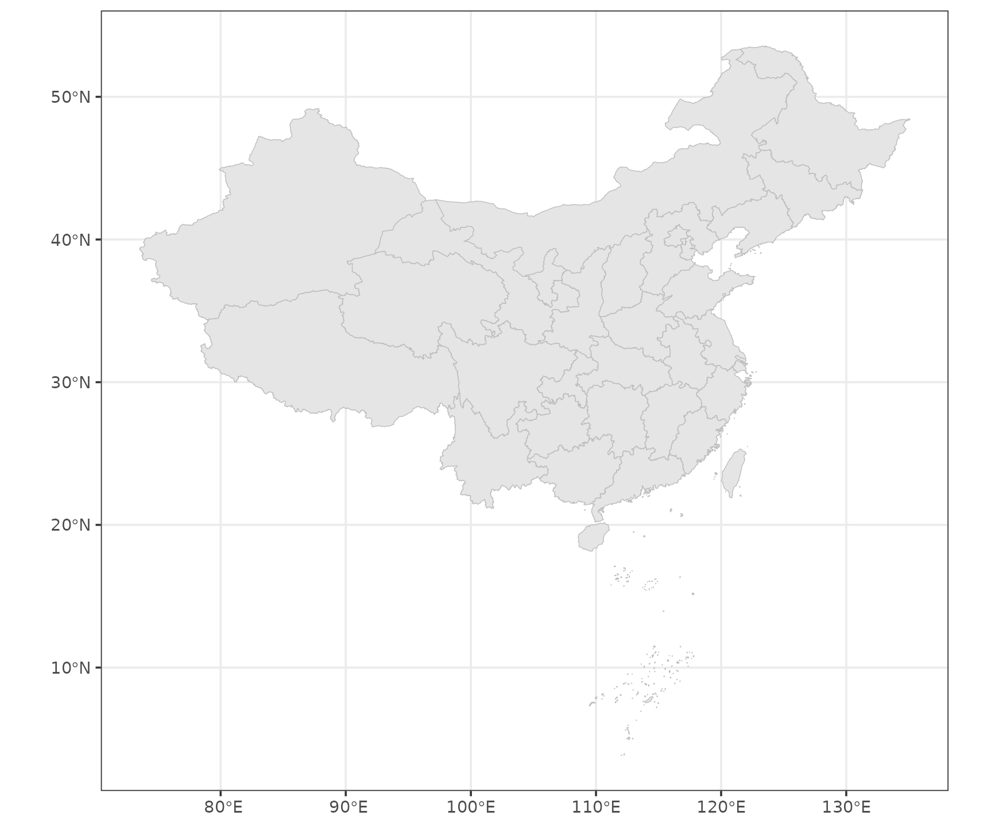
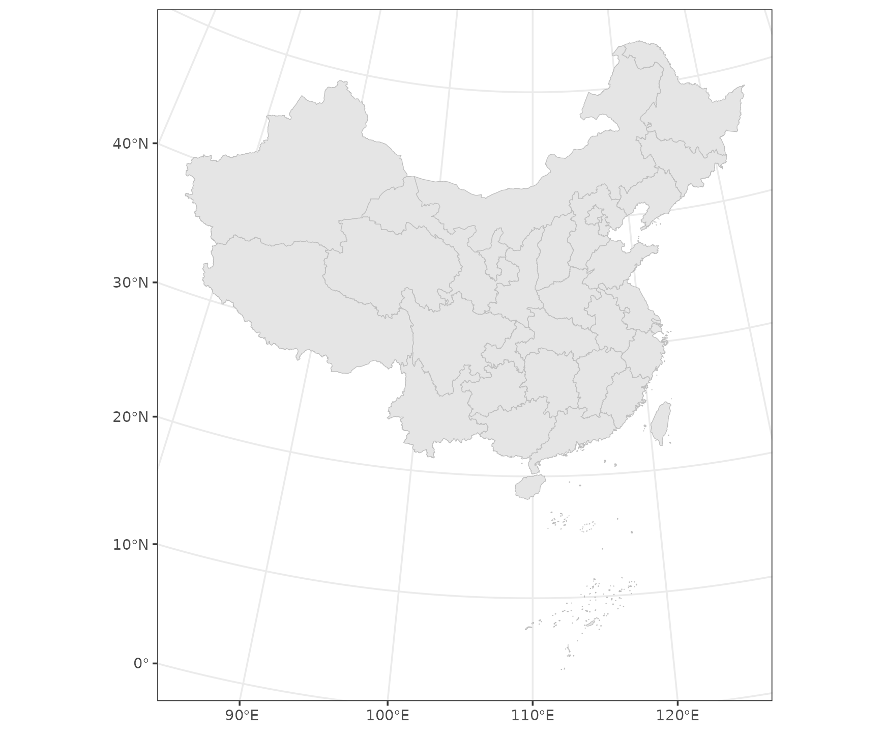

# Loads Spatial Data Sets Related to China

The [**geocn**](https://github.com/SpatLyu/geocn) package provides
various commonly used spatial data related to Chinese regions in the R
programming environment. This vignette presents a quick intro to
**geocn**.

### Available data sets

The **geocn** package covers 19 spatial data sets, including a variety
of relevant data from both the global and Chinese regions. You can view
what data sets are available using the
[`list_geocn()`](https://stscl.github.io/geocn/reference/list_geocn.md)
function.

``` r
library(sf)
## Linking to GEOS 3.12.1, GDAL 3.8.4, PROJ 9.4.0; sf_use_s2() is TRUE
library(geocn)
library(ggplot2)

datasets_geocn = list_geocn()
datasets_geocn
## # A tibble: 19 × 2
##    functions               results                                              
##    <chr>                   <chr>                                                
##  1 load_world_country      Global Country Boundaries                            
##  2 load_world_continent    Global Continents                                    
##  3 load_world_coastline    Global Coastlines                                    
##  4 load_world_ocean        Global Oceans                                        
##  5 load_world_lake         Global Lakes                                         
##  6 load_world_river        Global Rivers                                        
##  7 load_cn_province        Province-Level Administrative Units in China         
##  8 load_cn_city            City-Level Administrative Units in China             
##  9 load_cn_county          County-Level Administrative Units in China           
## 10 load_cn_border          China's Land Border Line and the 10-dash line of the…
## 11 load_cn_landborder      China's Land Border                                  
## 12 load_cn_coastline       Coastline of China                                   
## 13 load_cn_tenline         10-dash line of the South China Sea                  
## 14 load_cn_landcoast       China's Land Border and Coastline                    
## 15 load_tibetan_plateau    Tibetan Plateau Boundary                             
## 16 load_loess_plateau      Loess Plateau Boundary                               
## 17 load_yangtze_basin      Yangtze River Basin Boundary                         
## 18 load_yellow_river_basin Yellow River Basin Boundary                          
## 19 load_weihe_basin        Weihe River Basin Boundary
```

### Commonly Used CRS for Drawing Maps of China

The
[`load_cn_alberproj()`](https://stscl.github.io/geocn/reference/load_cn_alberproj.md)
function can be used to obtain the CRS information available in the
**sf** and **terra** packages. By default, it returns in **sf** format.
However, you can specify the return format through the `output`
parameter.

``` r
albers = load_cn_alberproj()

province = load_cn_province()
## Warning in CPL_read_ogr(dsn, layer, query, as.character(options), quiet, : GDAL
## Message 1: organizePolygons() received a polygon with more than 100 parts.  The
## processing may be really slow.  You can skip the processing by setting
## METHOD=SKIP.
ggplot(data = province) +
  geom_sf(fill = 'grey90', color = 'grey') +
  theme_bw()
```



``` r

province_albers = st_transform(province,albers)
ggplot(data = province_albers) +
  geom_sf(fill = 'grey90', color = 'grey') +
  theme_bw()
```



### Region-specific CRS Transformation in China

This section primarily focuses on the conversion between the GCJ02,
BD09, and WGS84 coordinate systems. The **geocn** provides
[`st_transform_cn()`](https://stscl.github.io/geocn/reference/st_transform_cn.md)
function to achieve the conversion. You need to input the longitude and
latitude coordinate vectors to be transformed as function parameters
`lon` and `lat`, and specify the CRS before transformation and the CRS
to be transformed. Please note that in the
[`st_transform_cn()`](https://stscl.github.io/geocn/reference/st_transform_cn.md)
function, the `from` and `to` parameters respectively refer to `wgs`,
`gcj`, `bd` for `WGS84`, `GCJ02`, `BD09` coordinate systems. Default
Conversion from GCJ02 to WGS84.

``` r
lon = c(126.626510,126.625261,126.626378,126.626541,126.626721,126.627732,126.626510)
lat = c(45.731596,45.729834,45.729435,45.729676,45.729604,45.730915,45.731596)
st_transform_cn(lon,lat)
## # A tibble: 7 × 2
##     lon   lat
##   <dbl> <dbl>
## 1  127.  45.7
## 2  127.  45.7
## 3  127.  45.7
## 4  127.  45.7
## 5  127.  45.7
## 6  127.  45.7
## 7  127.  45.7
```
